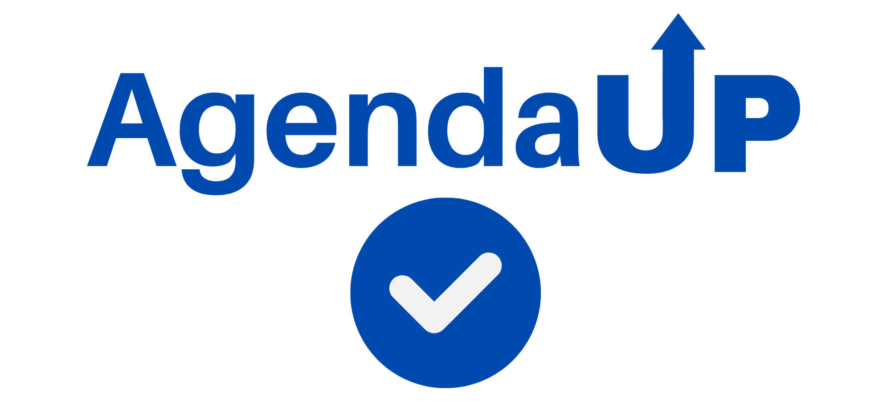

---
O AgendaUp é um projeto criado com o intuito de auxiliar os usuários a marcar compromissos e a criar convites de reuniões. Este projeto foi desenvolvido utilizando as seguintes tecnologias:

- React
- NodeJS
- MongoDB
- Vite
- Express
- Nginx

O deploy deste projeto foi realizado pela AWS, e pode ser encontrado em: http://54.146.233.205:5000/. O repositório possui uma pipeline com o Github Actions para automatizar o processo de atualização da aplicação que roda na instância EC2 da AWS

---
## Descritivo de desenvolvimento

O projeto possui duas aplicações principais:

- App: aplicação que se utiliza de um servidor para servir a aplicação React
- Backend: api de conexão com o MongoDB

